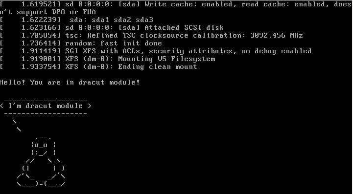

В Vagrantfile добавлена опция vb.gui = true для возможности управления процессом загрузки.

## Попасть в систему без пароля

Опции описаны в dracut.cmdline(7)

### 1. Использование командной строки dracut в конце обработки initramfs
При загрузке нажать клавишу e, отредактировать опции ядра:  
убрать опцию "console=ttyS0,115200n8"  
добавить опции "rd.break enforcing=0"  
Загрузить систему (Ctrl-x)  

Появится приглашение switch_root:/#  

    mount -o remount,rw /sysroot
    chroot /sysroot

Поменять пароль root (passwd)  
Выйти из chroot и switch_root (exit exit), загрузка системы продолжится.  
Зайти в систему с новым паролем, восстановить метки selinux:  

    restorecon /etc/shadow  

Перезагрузить систему.  

### 2. Замена init после загрузки initramfs
При загрузке нажать клавишу e, отредактировать опции ядра:  
убрать опцию "console=ttyS0,115200n8"  
заменить опцию "ro" на "rw"  
добавить опцию "init=/bin/bash"  

Загрузить систему (Ctrl-x)  
Поменять пароль root (passwd)  
Создать файл автоматического восстановления меток selinux:  

    touch /.autorelabel  

Перезагрузить систему:  

    exec /sbin/init 6  

## Переименовать VG

* [typescript_rename_vg](typescript_rename_vg) - typescript переименования VG

Краткое описание:

    vgrename VolGroup00 VolGroup01
    sed -i 's/VolGroup00/VolGroup01/g' /etc/fstab
    sed -i 's/VolGroup00/VolGroup01/g' /etc/default/grub
    sed -i 's/VolGroup00/VolGroup01/g' /boot/grub2/grub.cfg 
    mkinitrd -f -v /boot/initramfs-$(uname -r).img $(uname -r)

## Добавить модуль в initrd

* [module-setup.sh](module-setup.sh) - скрипт установки модуля
* [test.sh](test.sh) - скрипт вывода пингвина
* [typescript_dracut_module](typescript_dracut_module) - typescript работы

## Сконфигурировать систему без отдельного раздела с /boot, а только с LVM

* [rumyantsev.repo](rumyantsev.repo) - конфигурационный файл репозитория c патченным grub2,  
поддерживающим загрузку с LVM
* [typescript_grub2_lvm](typescript_grub2_lvm) - typescript работы

Подключить репозиторий, обновить grub2:

    cp /vagrant/rumyantsev.repo /etc/yum.repos.d/
    yum -y update grub2

Создать PV на дополнительном диске, скопировать /boot:

    pvcreate --bootloaderareasize 1m /dev/sdb
    vgcreate VolGroup01 /dev/sdb
    lvcreate -L 1G -n LogVolBoot VolGroup01
    mkfs.xfs /dev/VolGroup01/LogVolBoot
    mount /dev/VolGroup01/LogVolBoot /mnt
    cp -aR /boot/* /mnt/
    umount /boot
    umount /mnt

Отредактировать fstab, смонтировать LogVolBoot:

    vi /etc/fstab
    mount -av

Установить grub2 на дополнительный диск:

    grub2-install /dev/sdb

Отредактировать /boot/grub2/grub.cfg, добавить опцию insmod lvm,
заменить 'hd0,msdos2' на 'lvm/VolGroup01-LogVolBoot', заменить id /dev/sda2 на id /dev/VolGroup01/LogVolBoot

Для чистоты "эксперимента" удалить разделы sda1 и sda2, затереть MBR на /dev/sda

    dd if=/dev/zero of=/dev/sda bs=446 count=1
    fdisk /dev/sda

