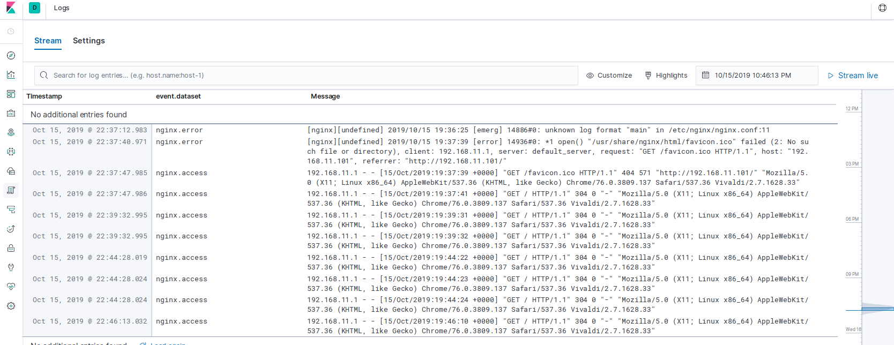

Стенд состоит из трёх виртуальных машин: web, log, elk.
Стенд разворачивается автоматически с помощью Vagrant Ansible Provisioner.

### web

Добавлено правило для аудита nginx.conf:

    -w /etc/nginx/nginx.conf -p wa

На машине настроена передача логов audit в rsyslog с помощью модуля audisp syslog (/etc/audisp/plugins.d/syslog.conf):

    active = yes
    direction = out
    path = builtin_syslog
    type = builtin.
    args = LOG_LOCAL6
    format = string

rsyslog сконфигурирован на пересылку логов audit на удалённый сервер log (/etc/rsyslog.conf):

    local6.* @192.168.11.102:514

сохранение логов audit локально отключено (/etc/audit/auditd.conf):

    write_logs = no

в rsyslog.conf настроено сохранение критичных логов локально и пересылка на удалённый сервер log:

    *.crit /var/log/critical
    *.crit @192.168.11.102:514

Установлен filebeat для пересылки логов nginx в logstash на сервер elk (/etc/filebeat/filebeat.yml):

    output.logstash:
      hosts: ["192.168.11.103:5044"]

Подключен модуль filebeat nginx (/etc/filebeat/modules.d/nginx.yml):

    - module: nginx
      access:
        enabled: true
        var.paths: ["/var/log/nginx/access.log"]
      error:
        enabled: true
        var.paths: ["/var/log/nginx/error.log"]

### log

Настроен сервер rsyslog для приёма сообщений по протоколам tcp и udp:

    # Provides UDP syslog reception
    $ModLoad imudp
    $UDPServerRun 514

    # Provides TCP syslog reception
    $ModLoad imtcp
    $InputTCPServerRun 514

### elk

Установлены elasticsearch, logstash, kibana.

Логи nginx с web:

