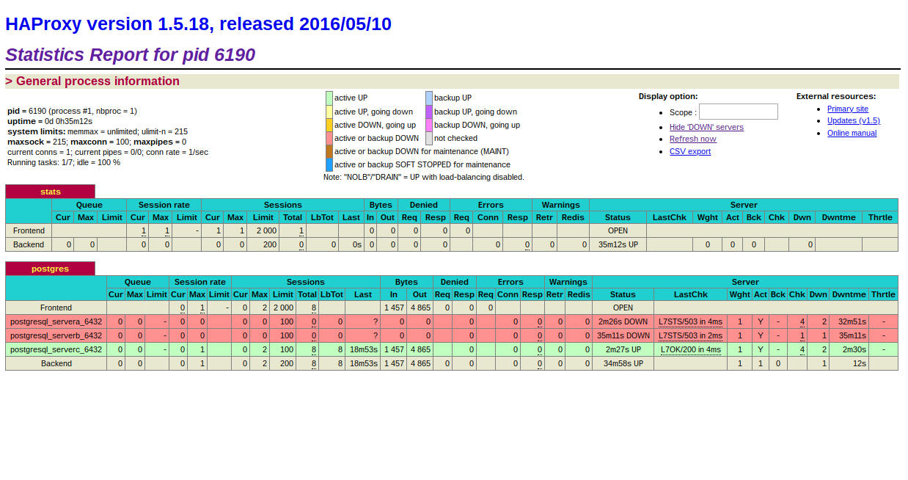

Стенд состоим из четырёх ВМ:  
servera 192.168.11.150  
serverb 192.168.11.151  
serverc 192.168.11.152  
haproxy 192.168.11.153  

Стенд разворачивается автоматически с помощью Vagrant Ansible Provisioner  
двумя сценариями ansible. Второй сценарий выполняется с опцией strategy: free  
для параллельного запуска сервиса etcd на всех узлах кластера.

Для пользователя БД postgres установлен пароль test.

### общая схема стенда

                                     |port 5000
                                +----+----+
                                | haproxy |
                                +----+----+
                                     |
                                     |
                +--------------------+--------------------+
                |                    |                    |
                |servera             |serverb             |serverc
         +------|-------+     +------|-------+     +------|-------+
         |      |6432   |     |      |6432   |     |      |6432   |
         | +----+-----+ |     | +----+-----+ |     | +----+-----+ |
         | |pgbouncer | |     | |pgbouncer | |     | |pgbouncer | |
         | +----+-----+ |     | +----+-----+ |     | +----+-----+ |
         |      |       |     |      |       |     |      |       |
         |      |5432   |     |      |5432   |     |      |5432   |
         | +----------+ |     | +----------+ |     | +----------+ |
         | |PostgreSQL| |     | |PostgreSQL| |     | |PostgreSQL| |
         | | patroni  | |     | | patroni  | |     | | patroni  | |
         | +----+-----+ |     | +----+-----+ |     | +----+-----+ |
         |      |       |     |      |       |     |      |       |
         |      |2379   |     |      |2379   |     |      |2379   |
         | +----+-----+ |     | +----+-----+ |     | +----+-----+ |
         | |  etcd    +---------+  etcd    +---------+  etcd    | |
         | +----------+ |     | +----------+ |     | +----------+ |
         +--------------+     +--------------+     +--------------+

### etcd

Проверка работы etcd:
<pre><code>
[root@servera ~]# etcdctl cluster-health
member 31e77cb11b6a4d1f is healthy: got healthy result from http://192.168.11.151:2379
member a07ce6eb8f2dab56 is healthy: got healthy result from http://192.168.11.150:2379
member fb628c6a6c090d25 is healthy: got healthy result from http://192.168.11.152:2379
cluster is healthy

[root@servera ~]# etcdctl member list
31e77cb11b6a4d1f: name=serverb peerURLs=http://192.168.11.151:2380 clientURLs=http://192.168.11.151:2379 isLeader=false
a07ce6eb8f2dab56: name=servera peerURLs=http://192.168.11.150:2380 clientURLs=http://192.168.11.150:2379 isLeader=false
fb628c6a6c090d25: name=serverc peerURLs=http://192.168.11.152:2380 clientURLs=http://192.168.11.152:2379 isLeader=true
</code></pre>

### servera

Статус кластера patroni после запуска стенда, лидер serverc:

<pre><code>
[root@servera ~]# patronictl -c /opt/app/patroni/etc/postgresql.yml list
+----------------------+---------+----------------+--------+---------+----+-----------+
|       Cluster        |  Member |      Host      |  Role  |  State  | TL | Lag in MB |
+----------------------+---------+----------------+--------+---------+----+-----------+
| patroni_cluster_otus | servera | 192.168.11.150 |        | running |  1 |         0 |
| patroni_cluster_otus | serverb | 192.168.11.151 |        | running |  1 |         0 |
<b>| patroni_cluster_otus | serverc | 192.168.11.152 | Leader | running |  1 |         0 |</b>
+----------------------+---------+----------------+--------+---------+----+-----------+
</code></pre>

### haproxy

Веб-интерфейс доступен по адресу http://192.168.11.153:7000

При подключении через haproxy попадаем на serverc, видно статус и слоты для
репликации servera и serverb:
<pre><code>
[root@haproxy ~]# psql -h 192.168.11.153 -p 5000 -U postgres

postgres=# select slot_name,slot_type,active from pg_replication_slots;
 slot_name | slot_type | active 
-----------+-----------+--------
 serverb   | physical  | t
 servera   | physical  | t
(2 rows)
</code></pre>

<pre><code>
postgres=# select usename,application_name,client_addr,state from pg_stat_replication;
-[ RECORD 1 ]----+---------------
usename          | replicator
application_name | servera
client_addr      | 192.168.11.150
state            | streaming
-[ RECORD 2 ]----+---------------
usename          | replicator
application_name | serverb
client_addr      | 192.168.11.151
state            | streaming
</code></pre>

Создание БД otus, тестовой таблицы и записи в тестовую таблицу для проверки репликации:
<pre><code>
postgres=# create database otus;
CREATE DATABASE
postgres=# \c otus
You are now connected to database "otus" as user "postgres".
otus=# create table dz (k serial, v varchar);
CREATE TABLE
otus=# insert into dz (v) values ('a');
INSERT 0 1
otus=# select * from dz;
 k | v 
---+---
 1 | a
(1 row)
</code></pre>

### servera

Проверка изменений, пришедших с лидера serverc:
<pre><code>
[root@servera ~]# psql -h 192.168.11.150 -p 6432 -U postgres
Password for user postgres: 
psql (12.1)
Type "help" for help.

postgres=# \c otus
You are now connected to database "otus" as user "postgres".
otus=# select * from dz;
 k | v 
---+---
 1 | a
(1 row)
</code></pre>

servera находится в процессе восстановления:
<pre><code>
otus=# select pg_is_in_recovery();
 pg_is_in_recovery 
-------------------
 t
(1 row
</code></pre>

### pgbouncer (serverc Leader)

Просмотр версии pgbouncer:
<pre><code>
[root@serverc ~]# psql -h 127.0.0.1 -p 6432 -U postgres pgbouncer

pgbouncer=# show version;
     version      
------------------
 PgBouncer 1.12.0
(1 row)
</code></pre>

Для БД otus и postgres выбран режим pool_mode session:
<pre><code>
pgbouncer=# show pools;
 database  |   user    | cl_active | cl_waiting | sv_active | sv_idle | sv_used | sv_tested | sv_login | maxwait | maxwait_us | pool_mode 
-----------+-----------+-----------+------------+-----------+---------+---------+-----------+----------+---------+------------+-----------
 otus      | postgres  |         1 |          0 |         0 |       0 |       0 |         0 |        0 |       0 |          0 | session
 pgbouncer | pgbouncer |         1 |          0 |         0 |       0 |       0 |         0 |        0 |       0 |          0 | statement
 postgres  | postgres  |         0 |          0 |         0 |       0 |       0 |         0 |        0 |       0 |          0 | session
(3 rows)
</code></pre>

В списке клиентов присутствует подключение с haproxy на serverc:
<pre><code>
pgbouncer=# show clients;
-[ RECORD 1 ]+------------------------
type         | C
user         | postgres
database     | otus
state        | active
<b>addr         | 192.168.11.153</b>
port         | 60256
<b>local_addr   | 192.168.11.152</b>
local_port   | 6432
connect_time | 2020-01-02 20:42:05 UTC
request_time | 2020-01-02 20:42:05 UTC
wait         | 0
wait_us      | 0
close_needed | 0
ptr          | 0x124a230
link         | 
remote_pid   | 0
tls          | 
-[ RECORD 2 ]+------------------------
type         | C
user         | postgres
database     | pgbouncer
state        | active
addr         | 127.0.0.1
port         | 47372
local_addr   | 127.0.0.1
local_port   | 6432
connect_time | 2020-01-02 20:52:50 UTC
request_time | 2020-01-02 20:53:46 UTC
wait         | 52
wait_us      | 62803
close_needed | 0
ptr          | 0x124a448
link         | 
remote_pid   | 0
tls          | 
</code></pre>

### switchover/failover

#### switchover

Изменение лидера patroni c serverc на servera:
<pre><code>
[root@servera ~]# patronictl -c /opt/app/patroni/etc/postgresql.yml switchover
Master [serverc]: 
Candidate ['servera', 'serverb'] []: servera
When should the switchover take place (e.g. 2020-01-02T21:55 )  [now]: 
Current cluster topology
+----------------------+---------+----------------+--------+---------+----+-----------+
|       Cluster        |  Member |      Host      |  Role  |  State  | TL | Lag in MB |
+----------------------+---------+----------------+--------+---------+----+-----------+
| patroni_cluster_otus | servera | 192.168.11.150 |        | running |  1 |         0 |
| patroni_cluster_otus | serverb | 192.168.11.151 |        | running |  1 |         0 |
| patroni_cluster_otus | serverc | 192.168.11.152 | Leader | running |  1 |         0 |
+----------------------+---------+----------------+--------+---------+----+-----------+
Are you sure you want to switchover cluster patroni_cluster_otus, demoting current master serverc? [y/N]: y
2020-01-02 20:56:06.85421 Successfully switched over to "servera"
+----------------------+---------+----------------+--------+---------+----+-----------+
|       Cluster        |  Member |      Host      |  Role  |  State  | TL | Lag in MB |
+----------------------+---------+----------------+--------+---------+----+-----------+
| patroni_cluster_otus | servera | 192.168.11.150 | Leader | running |  1 |           |
| patroni_cluster_otus | serverb | 192.168.11.151 |        | running |  1 |         0 |
| patroni_cluster_otus | serverc | 192.168.11.152 |        | stopped |    |   unknown |
+----------------------+---------+----------------+--------+---------+----+-----------+
</code></pre>

Статус кластера patroni после switchover, лидер servera:
<pre><code>
[root@servera ~]# patronictl -c /opt/app/patroni/etc/postgresql.yml list
+----------------------+---------+----------------+--------+---------+----+-----------+
|       Cluster        |  Member |      Host      |  Role  |  State  | TL | Lag in MB |
+----------------------+---------+----------------+--------+---------+----+-----------+
| patroni_cluster_otus | servera | 192.168.11.150 | Leader | running |  2 |         0 |
| patroni_cluster_otus | serverb | 192.168.11.151 |        | running |  2 |         0 |
| patroni_cluster_otus | serverc | 192.168.11.152 |        | running |  2 |         0 |
+----------------------+---------+----------------+--------+---------+----+-----------+
</code></pre>

#### failover

<pre><code>
[root@serverc ~]# patronictl -c /opt/app/patroni/etc/postgresql.yml list
+----------------------+---------+----------------+--------+---------+----+-----------+
|       Cluster        |  Member |      Host      |  Role  |  State  | TL | Lag in MB |
+----------------------+---------+----------------+--------+---------+----+-----------+
| patroni_cluster_otus | servera | 192.168.11.150 | Leader | running |  2 |         0 |
| patroni_cluster_otus | serverb | 192.168.11.151 |        | running |  2 |         0 |
| patroni_cluster_otus | serverc | 192.168.11.152 |        | running |  2 |         0 |
+----------------------+---------+----------------+--------+---------+----+-----------+
</code></pre>

Остановим сервис patroni на лидере для проверки failover:
<pre><code>
[root@servera ~]# systemctl stop patroni.service
</code></pre>

Статус кластера patroni после failover, лидер serverc, два узла:
<pre><code>
[root@serverc ~]# patronictl -c /opt/app/patroni/etc/postgresql.yml list
+----------------------+---------+----------------+--------+---------+----+-----------+
|       Cluster        |  Member |      Host      |  Role  |  State  | TL | Lag in MB |
+----------------------+---------+----------------+--------+---------+----+-----------+
| patroni_cluster_otus | servera | 192.168.11.150 |        | stopped |    |   unknown |
| patroni_cluster_otus | serverb | 192.168.11.151 |        | running |  3 |         0 |
| patroni_cluster_otus | serverc | 192.168.11.152 | Leader | running |  3 |         0 |
+----------------------+---------+----------------+--------+---------+----+-----------+

[root@serverc ~]# patronictl -c /opt/app/patroni/etc/postgresql.yml list
+----------------------+---------+----------------+--------+---------+----+-----------+
|       Cluster        |  Member |      Host      |  Role  |  State  | TL | Lag in MB |
+----------------------+---------+----------------+--------+---------+----+-----------+
| patroni_cluster_otus | serverb | 192.168.11.151 |        | running |  3 |         0 |
| patroni_cluster_otus | serverc | 192.168.11.152 | Leader | running |  3 |         0 |
+----------------------+---------+----------------+--------+---------+----+-----------+
</code></pre>

Запустим сервис patroni на servera:
<pre><code>
[root@servera ~]# systemctl start patroni.service
</code></pre>

В кластере три узла, лидер не изменился:
<pre><code>
[root@serverc ~]# patronictl -c /opt/app/patroni/etc/postgresql.yml list
+----------------------+---------+----------------+--------+---------+----+-----------+
|       Cluster        |  Member |      Host      |  Role  |  State  | TL | Lag in MB |
+----------------------+---------+----------------+--------+---------+----+-----------+
| patroni_cluster_otus | servera | 192.168.11.150 |        | running |  3 |         0 |
| patroni_cluster_otus | serverb | 192.168.11.151 |        | running |  3 |         0 |
| patroni_cluster_otus | serverc | 192.168.11.152 | Leader | running |  3 |         0 |
+----------------------+---------+----------------+--------+---------+----+-----------+
</code></pre>

### change configuration

#### without restart

Просмотр параметра temp_buffers на sevrerb:
<pre><code>
[root@serverb ~]# psql -h 127.0.0.1 -p 6432 -U postgres
postgres=# show temp_buffers;
 temp_buffers 
--------------
 8MB
(1 row)
</code></pre>

Изменим параметр temp_buffers не требующий перезапуска postgresql на servera:
<pre><code>
[root@servera etc]# patronictl -c /opt/app/patroni/etc/postgresql.yml edit-config
--- 
+++ 
@@ -3,6 +3,7 @@
 postgresql:
   parameters:
     wal_keep_segments: 100
+    temp_buffers: 16MB
   use_pg_rewind: true
   use_slots: true
 retry_timeout: 10

Apply these changes? [y/N]: y
Configuration changed
</code></pre>

Параметр temp_buffers применился на sevrerb:
<pre><code>
[root@serverb ~]# psql -h 127.0.0.1 -p 6432 -U postgres
Password for user postgres: 
psql (12.1)
Type "help" for help.

postgres=# show temp_buffers;
 temp_buffers 
--------------
 16MB
(1 row)
</code></pre>

#### with restart

Просмотр параметра shared_buffers на sevrerс:
<pre><code>
[root@serverc data]# psql -h 127.0.0.1 -p 6432 -U postgres
Password for user postgres: 
psql (12.1)
Type "help" for help.

postgres=# show shared_buffers;
 shared_buffers 
----------------
 128MB
(1 row)
</code></pre>

Изменим параметр shared_buffers требующий перезапуска postgresql на servera:
<pre><code>
[root@servera data]# patronictl -c /opt/app/patroni/etc/postgresql.yml edit-config
--- 
+++ 
@@ -4,6 +4,7 @@
   parameters:
     temp_buffers: 16MB
     wal_keep_segments: 100
+    shared_buffers: 256MB
   use_pg_rewind: true
   use_slots: true
 retry_timeout: 10

Apply these changes? [y/N]: y
Configuration changed
</code></pre>

Перезапуск кластера patroni для применения параметра на всех узлах:
<pre><code>
[root@servera data]# patronictl -c /opt/app/patroni/etc/postgresql.yml restart patroni_cluster_otus
When should the restart take place (e.g. 2020-01-02T22:34)  [now]: 
+----------------------+---------+----------------+--------+---------+----+-----------+-----------------+
|       Cluster        |  Member |      Host      |  Role  |  State  | TL | Lag in MB | Pending restart |
+----------------------+---------+----------------+--------+---------+----+-----------+-----------------+
| patroni_cluster_otus | servera | 192.168.11.150 |        | running |  3 |         0 |        *        |
| patroni_cluster_otus | serverb | 192.168.11.151 |        | running |  3 |         0 |        *        |
| patroni_cluster_otus | serverc | 192.168.11.152 | Leader | running |  3 |         0 |        *        |
+----------------------+---------+----------------+--------+---------+----+-----------+-----------------+
Are you sure you want to restart members servera, serverb, serverc? [y/N]: y
Restart if the PostgreSQL version is less than provided (e.g. 9.5.2)  []:   
Success: restart on member servera
Success: restart on member serverb
Success: restart on member serverc
</code></pre>

Параметр temp_shared_buffers применился на sevrerc:
<pre><code>
[root@serverc data]# psql -h 127.0.0.1 -p 6432 -U postgres
Password for user postgres: 
psql (12.1)
Type "help" for help.

postgres=# show shared_buffers;
 shared_buffers 
----------------
 256MB
(1 row)
</code></pre>

Параметр temp_shared_buffers применился на sevrerb:
<pre><code>
[root@serverb ~]# psql -h 127.0.0.1 -p 6432 -U postgres
Password for user postgres: 
psql (12.1)
Type "help" for help.

postgres=# show shared_buffers;
 shared_buffers 
----------------
 256MB
(1 row)
</code></pre>
