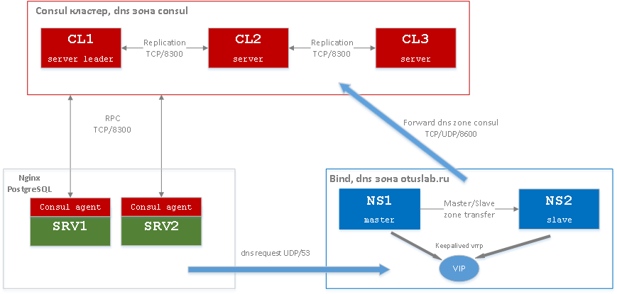
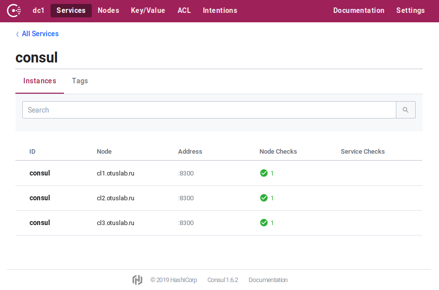

### Кластер Consul с функциями обнаружения и проверки работоспособности сервисов, интегрированный с отказоустойчивым рекурсивным DNS на основе bind и keepalived.

### Описание стенда

Основная часть стенда состоит из пяти ВМ:  

- ns1.otuslab.ru - master сервер bind, узел keepalived  
- ns2.otuslab.ru - slave сервер bind, узел keepalived  
- cl1.otuslab.ru - сервер кластера Consul  
- cl2.otuslab.ru - сервер кластера Consul  
- cl3.otuslab.ru - сервер кластера Consul  

Дополнительно в стенде используются две ВМ для демонстрации  
функций Service Discovery и Health Checking Consul:  

- srv1.otuslab.ru - сервер Nginx и PostgreSQL  
- srv2.otuslab.ru - сервер Nginx и PostgreSQL  

### Ansible

В стенде используются роли ansible:  

- dns-lvs - установка bind в режиме master/slave и keepalived. Режим сервера bind и keepalived выбирается переменной dns_role (master/backup)  
- set-dns-ip - настройка IP-адреса dns сервера
- consul - установка consul в роли server или agent, тип выбирается переменной consul_role  
- nginx - установка nginx, регистрация сервиса web в consul  
- postgres - установка сервера postgresql, регистрация сервиса postgresql в consul  

### DNS

Интеграция Consul и рекурсивного сервера DNS может осуществляться несколькими способами.  
В данном стенде все запросы от клиентов поступают на сервер bind, для зоны consul настроена пересылка на кластер Consul.  

Система разрешения имён тестовой зоны otuslab.ru состоит из двух узлов - ns1 и ns2.  
Сервер ns1 работает в роли master, ns2 slave.  
На серверах установлен keepalived, который управляет выделенным ip (VIP) адресом.  
Для проверки доступности bind используется скрипт check_named.sh.  
<pre><code>
[root@ns1 ~]# ip -4 address show dev eth1
3: eth1: <BROADCAST,MULTICAST,UP,LOWER_UP> mtu 1500 qdisc pfifo_fast state UP group default qlen 1000
    inet 192.168.11.148/24 brd 192.168.11.255 scope global noprefixroute eth1
       valid_lft forever preferred_lft forever
<b>    inet 192.168.11.147/24 scope global secondary eth1</b>
       valid_lft forever preferred_lft forever

[root@ns1 ~]# systemctl stop named.service

[root@ns1 ~]# tail /var/log/messages 
Feb  3 16:19:35 localhost Keepalived_vrrp[7016]: /usr/libexec/keepalived/check_named.sh exited with status 2
...
</code></pre>

При отказе сервера bind на ns1 VIP мигрирует на на ns2:
<pre><code>
[root@ns2 ~]# grep Keepalived_vrrp /var/log/messages
...
Feb  3 16:19:23 localhost Keepalived_vrrp[6903]: VRRP_Instance(VI_1) Transition to MASTER STATE
Feb  3 16:19:24 localhost Keepalived_vrrp[6903]: VRRP_Instance(VI_1) Entering MASTER STATE
Feb  3 16:19:24 localhost Keepalived_vrrp[6903]: VRRP_Instance(VI_1) setting protocol VIPs.
Feb  3 16:19:24 localhost Keepalived_vrrp[6903]: Sending gratuitous ARP on eth1 for 192.168.11.147
...

[root@ns2 ~]# ip -4 address show dev eth1
3: eth1: <BROADCAST,MULTICAST,UP,LOWER_UP> mtu 1500 qdisc pfifo_fast state UP group default qlen 1000
    inet 192.168.11.149/24 brd 192.168.11.255 scope global noprefixroute eth1
       valid_lft forever preferred_lft forever
<b>    inet 192.168.11.147/24 scope global secondary eth1</b>
       valid_lft forever preferred_lft forever
</code></pre>
В качестве сервера разрешения имён на узлах стенда используется virtual IP-адрес  
keepalived.  

### Consul кластер

Кластер состоих из трёх узлов cl1, cl2, cl3.  
Процесс bootstrap кластера происходит автоматически, опция retry_join = cl.otuslab.ru.  
Для SOA записи cl.otuslab.ru определены три ip адреса, соответствующие узлам кластера.  

Статус кластера после запуска:  
<pre><code>
[root@cl1 ~]# consul members
Node            Address              Status  Type    Build  Protocol  DC   Segment
cl1.otuslab.ru  192.168.11.153:8301  alive   server  1.6.2  2         dc1  <all>
cl2.otuslab.ru  192.168.11.154:8301  alive   server  1.6.2  2         dc1  <all>
cl3.otuslab.ru  192.168.11.155:8301  alive   server  1.6.2  2         dc1  <all>

[root@cl1 ~]# consul operator raft list-peers
Node            ID                                    Address              State     Voter  RaftProtocol
cl2.otuslab.ru  7d880512-ae07-c98e-c5ca-b7b2c17d0db2  192.168.11.154:8300  leader    true   3
cl1.otuslab.ru  d22ffe8d-f12b-fac2-4468-66b9c46490c9  192.168.11.153:8300  follower  true   3
cl3.otuslab.ru  443f93be-376b-120b-1b6a-456b0c32eb0d  192.168.11.155:8300  follower  true   3
</code></pre>
Для просмотра статуса кластера можно использовать web интерфейс http://cl.otuslab.ru:8500:  

### Service Discovery и Health Checking

ВМ srv1 и srv2 работают серверы Nginx и PostgreSQL.  
Агенты Consul регистрируют сервисы web и postgresql в кластере Consul.  
<pre><code>
[root@ns2 ~]# dig +short web.service.consul
192.168.11.157
192.168.11.156

[root@ns2 ~]# dig +short web.service.consul SRV
1 1 80 srv1.otuslab.ru.node.dc1.consul.
1 1 80 srv2.otuslab.ru.node.dc1.consul.

[root@ns2 ~]# dig +short postgresql.service.consul
192.168.11.157
192.168.11.156

[root@ns2 ~]# dig +short postgresql.service.consul SRV
1 1 5432 srv2.otuslab.ru.node.dc1.consul.
1 1 5432 srv1.otuslab.ru.node.dc1.consul.
</code></pre>
Сервисы можно просмотреть с помощью HTTP API:  
<pre><code>
[root@cl1 ~]# curl -s http://cl.otuslab.ru:8500/v1/catalog/services | jq
{
  "consul": [],
  "postgresql": [
    "postgresql"
  ],
  "web": []
}
</code></pre>
В случае отказа сервиса его запись не показывается в DNS:  
<pre><code>
[root@srv1 ~]# systemctl stop nginx.service

[root@ns2 ~]# dig +short web.service.consul SRV
1 1 80 srv2.otuslab.ru.node.dc1.consul.
</code></pre>

Проверка сервиса через HTTP API:
<pre><code>
[root@cl1 ~]# curl -s http://127.0.0.1:8500/v1/health/service/web | jq
...
      {
        "Node": "srv1.otuslab.ru",
        "CheckID": "service:web",
        "Name": "Service 'web' check",
        "Status": "critical",
...
        "Node": "srv2.otuslab.ru",
        "CheckID": "service:web",
        "Name": "Service 'web' check",
        "Status": "passing",
...
</code></pre>

<pre><code>
[root@cl1 ~]# curl -s http://cl.otuslab.ru:8500/v1/health/checks/web | jq
[
  {
    "Node": "srv1.otuslab.ru",
    "CheckID": "service:web",
    "Name": "Service 'web' check",
    "Status": "critical"
...
  },
  {
    "Node": "srv2.otuslab.ru",
    "CheckID": "service:web",
    "Name": "Service 'web' check",
    "Status": "passing"
...
</code></pre>
